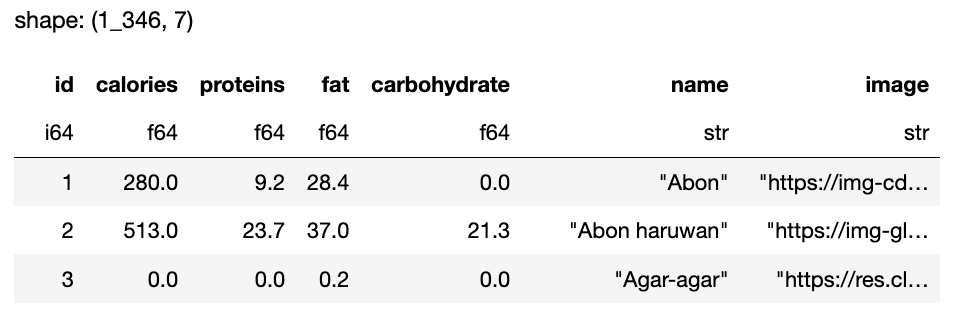

# 2 Creating functions over stores

The agent has an `available_functions_search` that it can use to lookup functions. It can also be supplied with a list of functions up front. We always want to use the supplied functions and only fall back to the search if needed. This means the functions also need to describe what they can do (and cannot do) so the interpreter will use them first if it is sensible to do so.\


In `funkyprompt` we can have different types of functions; `api` , `default` `stores` are thee types. `api` uses a proxy to make REST requests. `stores` are actually different types of stores like `vector-store` and `columnar-store` while the `default` will just load functions in python from a registry. In all cases we save the functions to a registry.

When creating a store like a vector store, when it is crated for the first time it will register the store in a registry. This registry is in fact just another vector-store that can be searched.&#x20;

```
from funkyprompt import FunkyRegistry
reg = FunkyRegistry()
reg.load() #this will list a Polars dataframe of functions
```

<figure><figcaption><p>sample functions</p></figcaption></figure>

The content of the function description is embedded for search. The \`metadata\` describes how to reconstruct the function. For example for these stores, a factory can be use to load the correct stores and expose its search function.

While stores are registered on creation, we can see how this is done by explicitly registering the function again

```python
Model = InstructEmbeddingContentModel.create_model('BookChapters')
store = VectorDataStore(Model, description="A store of different book chapters")
store.register_store()
```

This allows us to search for stores/functions in different way. We could do a lookup on function names or we could do a vector search on possibly long-form textual descriptions of what functions can do. This is design for a case when we have a very large number of functions/stores.

If we see a store that we like we can quickly restore it from the data in the registry (as an alternative to loading it using a model). Here are two ways to load a store

```python
#method 1 - searching and loading stores
eg = reg.load().to_dicts()[1]
from funkyprompt.io.stores import AbstractStore
store = AbstractStore.restore_from_data(eg)

#method 2 - using types to pick a store based on namespace/name conventions
from funkyprompt.model import AbstractModel
from funkyprompt.io import VectorDataStore
Model = AbstractModel.create_model('BookChapters', namespace='default')
store = VectorDataStore(Model, description='restored book chapters')
store.load()
```

## Using stores in LLMs

Now that we understand how to save functions to run searches on stores and to save and reload them in different ways, we can build some search tools to find functions when we need them and use them in the LLM. The LLM has a search function it uses to find and load functions as it runs the InterpreterLoop. We take the position that if the right stores are found and these are narrow in scope and capabalbe of answering the right questions, the real challenge is instead the routing problem of making sure the LLM does indeed select the right functions to use.


```python
ag = store.as_agent()
ag('Where is is the H-4 clock today according to the books you have read?')
```


This example sets up the agent to bias for using this function. This allows us to test the logic. The first thing we can do is passed the question to the vector store and this will return the raw results. Then we can use the appeoach above to get an agent to use the function. The response is


```
The H-4 clock, according to the books that have been read, is lying in state in an exhibit case at London\'s National Maritime Museum. It draws millions of visitors a year and is considered an important timekeeper that is not currently running to preserve its condition. It could operate if allowed, but the curators do not run it to avoid wear and ensure its preservation for future generations. \n\nMy confidence in this answer is high as it is based on an excerpt from a source that explicitly states the current location and state of the H-4 clock.\n\nThe strategy used to find this information was to run a vector search with the question "Where is the H-4 clock today according to the books you have read?" to retrieve relevant content from the available books
```


However what we really what to do is to have the agent first search for functions


```python
funkyprompt.agent('Where is is the H-4 clock today - you may need to search for books first?')
```


Below im using a strategy in the agent that explains what it is doing for debugging purposes. It returns the correct answer and explains what it did also.





```
The H-4 clock is currently located in the National Maritime Museum in London. It is on display in an exhibit case but does not run, as the curators have decided not to wind it in order to preserve it for posterity. H-4 could run if wound up, but it would require daily winding, similar to the large sea clocks it is displayed alongside. However, due to its delicate nature and the risk involved in constant handling, as well as the previous experiences of damage during transfers and exhibitions, it has been left stationary to avoid any potential harm.\n\nMy confidence level is high, as the information comes directly from the context provided by books related to the subject.\n\nFor the strategy: I initially used the `search_functions` command to seek out relevant functions that could lead to information on the H-4 clock. After reviewing the functions, I selected `vectordatastore_search_default_bookchapters` since this would likely contain historical or topical information about the H-4 clock. The vector datastore search returned excerpts from texts thadescribe the history and current status of H-4, which informed the answer above.
```


